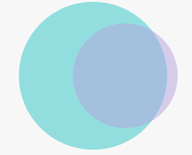
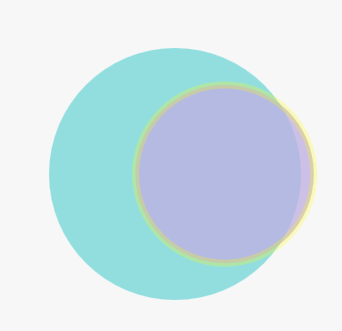
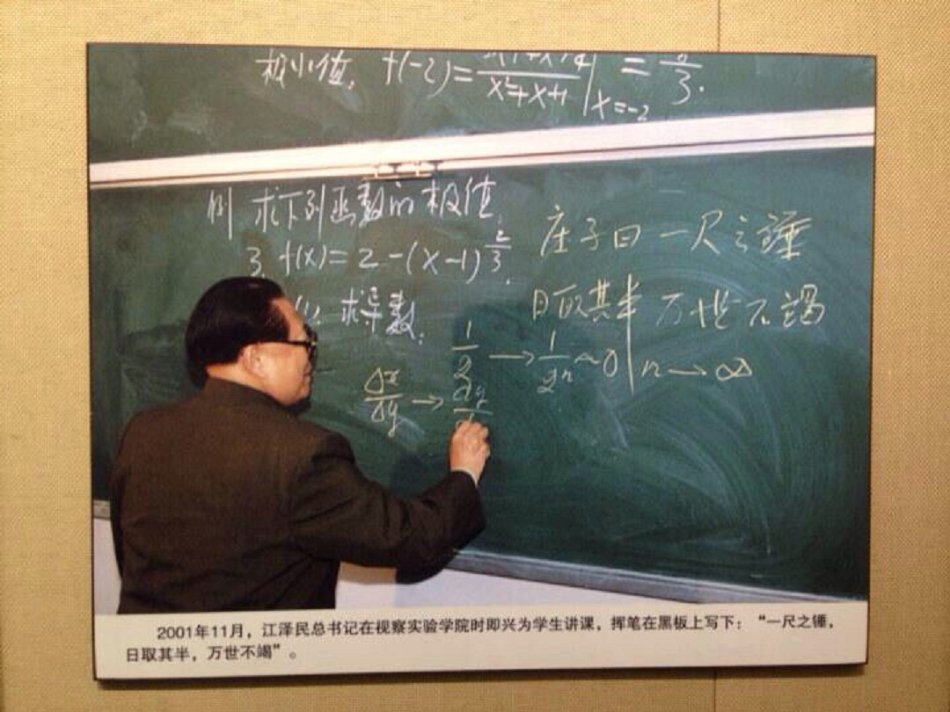

使用逼近算法生成韦恩图的探究与经验
=======

维恩图（venn），也叫文氏图，用于显示元素集合重叠区域的图示。我们准备在echarts中提供这类图表。第一期支持两个集合的韦恩图，后期准备支持三个集合乃至多个集合的韦恩图

## 准备
使用zrender框架，画出两个circle使之重叠，即可产生一个韦恩图。但是，互相重叠的部分会相互遮挡，（如下图）解决方案是对每个circle都调整透明度至50%。


## 确定位置
下面最困难的就是在确定一个圆的位置的情况下，根据两个集合的大小与交集的大小，确定第二个圆的位置。对于这一点，我进行了几个尝试。

### 尝试一————估值
由于韦恩图本身可以看做一个非精确图标。所以，猜测了一个值。即两个圆心的距离的表达式是

```javascript
var coincideLength = ((r0+r1)/2)*Math.sqrt(data[2].value)/Math.sqrt((data[0].value+data[1].value)/2);
```
两个圆心的距离与两圆半径均值之比等于交集与两集合均值的开方之比。
但我们知道，同等半径、边长等情况下，圆的面积最大。所以这种方法计算的距离是偏小的，公共面积是偏大的。
而且当一个集合为另一个的子集时，误差过大。（如下图）



### 尝试二————计算
既然估计是不可行的，那么我就采取计算的方法。凭借我深（xue）厚（zha）的数学功底，应该能算出来圆心的距离。
省略1w字。
然后我确定我是计算不出来的。此方法也是不可行的。

### 尝试三————逼近算法
在网上进行了一系列的调研，我发现在尝试二中，我犯了一个计算机专业大一学渣都不应该犯的一个错误。就是一直使用高中数学的思维来解决问题，而没有用计算机思维。所谓计算机思维我认为核心有两点：
1. 计算机性能优越，可以短时间计算大规模的数据
2. 计算机允许计算无数次（递归思想）
所以调研发现，诸如d3等支持维恩图的图表框架，都使用了逼近算法来计算。也就是带进去一个值去计算，不对了就换个值再计算一遍。

## 逼近算法
这里就是猜测一个coincideLength，代入计算出公共面积，然后与实际公共面积进行比较。在一定的可接受的精度内，得到coincideLength。否则，对coincideLength调整，递归代入，直至在一定的可接受的精度内，递归结束。
于是，开始编写代码。在此过程中遇到了若干问题。

### 问题一————对coincideLength调整调整不力
先设定一个coincideLength的锚定，coincideLengthAnchor。
当coincideLengthAnchor过小，需要增大时，我使用了：
```javascript
var coincideLengthAnchor = (coincideLengthAnchor + r0 + r1)/2;
```
当coincideLengthAnchor过大，需要减小时，我使用了：
```javascript
coincideLengthAnchor = Math.abs(coincideLengthAnchor - Math.abs(r0 - r1))/2;
```
我理解的是，距离最大值就是两圆外切也就是r0 + r1；距离最小时就是两圆内切也就是Math.abs(r0 - r1)。
想法很好。当然大牛的你们也发现问题了。这样做会造成数值抖动。最后报too much recursion算是好的。我才不会乱说我把浏览器不知道卡死了多少次呢。
所以要对每次的边界值做出相应的调整，这样递归函数增加两个参数，coincideLengthAnchorMin, coincideLengthAnchorMax。
当coincideLengthAnchor过小，下次递归的下限就是这次的锚定值
```javascript
coincideLengthAnchorMin = coincideLengthAnchor;
```
当coincideLengthAnchor过大，下次递归的上限就是这次的锚定值
```javascript
coincideLengthAnchorMax = coincideLengthAnchor;
```

### 问题一————精度调整
上面也说到了。递归最后的coincideLength不可能百分比精确。那么我使用
```javascript
var scaleAnchor = (alfa*r0*r0 - x*r0*Math.sin(alfa) + beta*r1*r1 - y*r1*Math.sin(beta))/(r0*r0*Math.PI);
var scale = value3/value0;
var approximateValue = Math.abs(scaleAnchor/scale);
```
scaleAnchor为计算的公共面积比第一个圆的面积。
scale为实际的公共面积比第一个圆的面积。
approximateValue就为精度。

开始时我把精度设为下限0.9上限1.1。得到的图基本正确，但是在两圆内切的特殊情况下就杯具了：



那我为什么不把精度调整的特别高呢？我们知道二分法计算，“一尺之棰，日取其半，万事不竭”。精度过高，特别是数值特别大的时候，计算的速度又会特别慢。



所以，我调整精度为下限0.999上限1.001。

## 结论
完整递归函数：
```javascript
_getCoincideLength: function (value0, value1, value3, r0, r1, 
	coincideLengthAnchor, coincideLengthAnchorMin, coincideLengthAnchorMax) {
    var x = (r0*r0 - r1*r1)/(2*coincideLengthAnchor) + coincideLengthAnchor/2;
    var y = coincideLengthAnchor/2 - (r0*r0 - r1*r1)/(2*coincideLengthAnchor);
    var alfa = Math.acos(x/r0);
    var beta = Math.acos(y/r1);
    var scaleAnchor = (alfa*r0*r0 - x*r0*Math.sin(alfa) + beta*r1*r1 - y*r1*Math.sin(beta))/(r0*r0*Math.PI);
    var scale = value3/value0;
    var approximateValue = Math.abs(scaleAnchor/scale);
    if (approximateValue > 0.999 && approximateValue < 1.001) {
        return coincideLengthAnchor;
    }
    // 若是公共面积比较小，使距离减小一些，让公共面积增大
    else if (approximateValue <= 0.999) {
        var coincideLengthAnchorMax = coincideLengthAnchor;
        coincideLengthAnchor = (coincideLengthAnchor + coincideLengthAnchorMin)/2;
        return this._getCoincideLength(value0, value1, value3, r0, r1,
            coincideLengthAnchor, coincideLengthAnchorMin, coincideLengthAnchorMax);
    }
    // 若是公共面积比较大，使距离增大一些，让公共面积减小
    else {
        var coincideLengthAnchorMin = coincideLengthAnchor;
        coincideLengthAnchor = (coincideLengthAnchor + coincideLengthAnchorMax)/2;
        return this._getCoincideLength(value0, value1, value3, r0, r1,
            coincideLengthAnchor, coincideLengthAnchorMin, coincideLengthAnchorMax);
    }
}
```
这篇文章，可能没有达到要求。也并没有多么高深的技术。就是想分享一下，在遇到一个问题的探究过程中，碰到的有趣的经历与总结的一些经验。
这些经历与经验如果能给诸位在以后的工作中贡献绵薄，我也就十分欣慰了。
