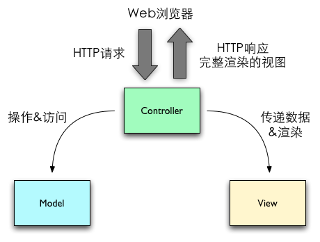
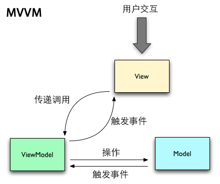
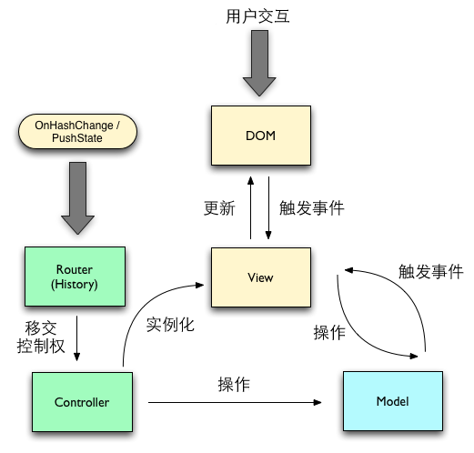
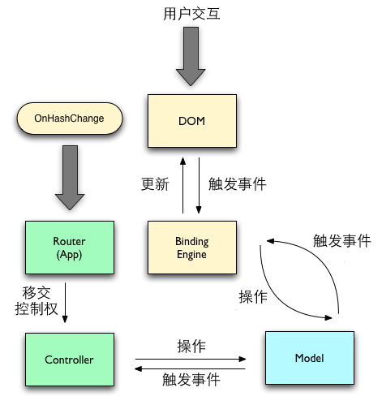
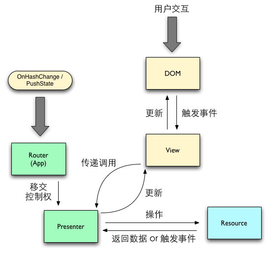
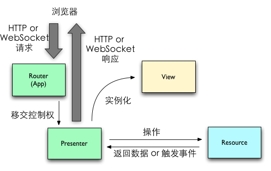
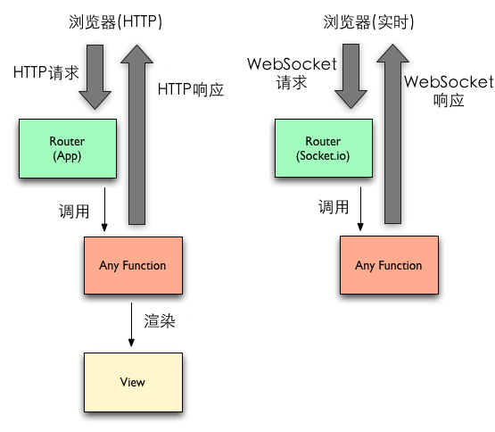

原文：[http://blog.nodejitsu.com/scaling-isomorphic-javascript-code/](http://blog.nodejitsu.com/scaling-isomorphic-javascript-code/)

译者注：这是一篇2011年的老文了，最近苦恼于单页面应用的首屏速度与SEO问题，期望本文能给有同样烦恼的同学们带来些启示。

先花点时间想想你是有多么频繁地听到“Model-View-Controller”（MVC）这词儿，但你真正明白它的意义吗？在较高层次上而言，它是指在一个基于图像系统（非光栅化图像，比如游戏）以展示为主的应用中对功能的[关注点分离（separation of concerns）](http://en.wikipedia.org/wiki/Separation_of_concerns)。进一步看，它就是一堆表示不同事物的专有名词。过去，许多开发者社区都创造了各自的MVC解决方案，它们都能很好地应对流行的案例，并且在一步一步地发展。最好的例子就是Ruby和Python社区以及它们基于MVC架构的Rails与Django框架。

MVC模式已经被其它语言所接受，比如Java，Ruby和Python。但是对于Node.js而言还不够好，其中的一个原因就是：**Javascript现在是一个同构的语言了**。**同构**的意义就在于任何一段代码（当然有些特殊代码例外）都能同时跑在客户端与服务器端。从表面上讲，这个看似无害的特性带来了一系列当前的MVC模式无法解决的挑战。在这篇文章中我们会探寻目前存在一些的模式，看看它们都是怎样实现的，同时关注不同的语言及环境。另外也谈谈它们为什么对于真正同构的Javascript而言还不够好。在最后，我们会了解一种全新的模式：[Resource-View-Presenter](#resource-view-presenter%E4%BB%8B%E7%BB%8D)。

<!-- more -->

## 题要

设计模式在应用开发中至关重要。它们概述、封装了应用程序及其环境中值得关注的地方。在浏览器与服务器之间这些关注点差异很大：

* 视图是短暂的（如在服务器上）还是长期存在的（如在浏览器上）？
* 视图是否能跨案例或场景复用？
* 视图是否该被应用特定的标签标记？
* 一堆堆的业务逻辑应该放哪里？（在Model中还是在Controller中？）
* 应用的状态应该如何持久化和访问？

让我们来关注下目前存在的一些模式，看看它们是如何回答上面这些问题的：

* [Model-View-Controller](#mvc)
* [Model2](#model2)
* [Model-View Presenter and Model-View-ViewModel](#mvp--mvvm)
* [现代化的Javascript实现](#%E7%8E%B0%E4%BB%A3%E5%8C%96%E7%9A%84javascript%E5%AE%9E%E7%8E%B0)
* [Resource-View-Presenter介绍](#Resource-View-Presenter%E4%BB%8B%E7%BB%8D)
* [结语](#%E7%BB%93%E8%AF%AD)

## MVC


传统的Model-View-Controller模式（译注：为了与后续的Presenter, ViewModel保持一致，Model, View, Controller都不做翻译）假定View是持续的，同时，Controller是可热插拔的。比如说一个View对于是否登陆会对应不同的Controller。在一个较高的层次上而言，MVC并不关注View是如何被渲染（如具体是采用何种模版引擎）。

通过View是持续的及View定义用户交互来看，传统的MVC是对前端开发十分有利的模式。稍后我们会看到现实中，[Backbone.js](http://backbonejs.org/)实现的一个稍微改动的MVC模式。

## Model2



如果之前从来没有听过[Model2](http://en.wikipedia.org/wiki/Model_2)，请不要惊慌。它是一个可以追溯到1999年的设计模式，由Govind Seshadri提出并发表在[Understanding JavaServer Pages Model 2 architecture](http://www.javaworld.com/article/2076557/java-web-development/understanding-javaserver-pages-model-2-architecture.html)。可以说，Model2并不需要完全实现MVC模式，但现代大多数的实现（比如[Ruby on Rails](http://andrzejonsoftware.blogspot.com/2011/09/rails-is-not-mvc.html)）都以那种方式来设计。

在像Ruby on Rails的那些类Model2的框架中有一个共识：“富Model、瘦Controllers”。这不适用于所有的应用，但在作者看来，在实践中这一思路应用得还是相当广泛的。由于传统MVC中的Controller需要监听View并对输入作出反应，Controller会趋于繁重（比如越来越多的业务逻辑），因此“富Model、瘦Controller”的方式看上去更优。

鉴于无状态的HTTP，Model2的View是很短暂的：不同请求之间，View不保持状态。在大多数服务器端框架中，应用的状态都是通过[Session Cookies](http://en.wikipedia.org/wiki/HTTP_cookie)存储的。这使得Controller与View之间的单向通信非常有序，但这却不便于前端的开发。

## MVP & MVVM

MVP(Model-View-Presenter)和MVVM(Model-View-ViewModel)模式与传统的MVC十分类似，除了以下几个关键区别：

* View不再直接持有对Model的引用
* Presenter(或ViewModel)持有对View的引用并借助Model的改变来更新View

MVP模式被Martin Fowler多次论述（[这儿](http://www.martinfowler.com/eaaDev/uiArchs.html)还有[这儿](http://martinfowler.com/eaaDev/ModelViewPresenter.html)），并且经常基于以下两个不同的实现来讨论：

* [被动的View（Passive View）](http://www.martinfowler.com/eaaDev/PassiveScreen.html)：设计尽可能简单的View，除了必要的界面操作，其它所有的业务逻辑都应该包含在Presenter中
* [监督Controller（Supervising Controller）](http://www.martinfowler.com/eaaDev/SupervisingPresenter.html)：View可以包含简单的逻辑，Presenter只处理那些View无法处理的系统需求




MVP与MVVM几乎难以区分，除了一点：MVVM假定ViewModel中的改变会通过一个稳健的数据绑定引擎反映到View中。Niraj Bhatt在他的《[MVC vs. MVP vs. MVVM](http://nirajrules.wordpress.com/2009/07/18/mvc-vs-mvp-vs-mvvm/)》一文中指出：“如果在MVP中View有一个叫isChecked的属性并且由Presenter来设置的话，那么在MVVM中ViewModel也会有一个叫isChecked的属性并且与View保持同步。”

MVP与MVVM的优势是Presenter（或ViewModel）更容易进行单元测试。这是因为View的状态是由Presenter通过方法调用（MVP）或者由ViewModel通过属性设置（MVVM）来确定的。

对前端开发而言这两个模式都是可接受的好选择。在浏览器中，路由层可以将控制权交由适当的Presenter（或ViewModel），后者又可以更新并响应持续的View。通过一些小修改这两个模式都可以很好的运行在服务器端，其中的原因就在于Model与View之前没有直接的联系，这允许短暂View经由给定的Presenter（或ViewModel）进行渲染。就像稍后会描述的那样，这种改变后的模式就是真正意义上的同构。

## 现代化的Javascript实现

上面介绍的那些模式目前已经有许多现代化的实现：

* [Backbone.js](http://backbonejs.org/)
* [Batman.js](http://batmanjs.org/)
* [Angularjs](http://angularjs.org/)
* [Javascript MVC](http://www.javascriptmvc.com/)
* [Sammy](http://sammyjs.org/)

这些框架通常都用于构建单页面应用（SPA, Singele-Page Application）。单页面应用的用户交互有两个截然不同的特点

* onHashChange 和 pushState 事件：当浏览器的URL改变时触发，比如导航到某某页面
* DOM 事件：当用户在DOM上进行特定交互时触发，比如点击锚点标签

让我们来瞅瞅具体的框架，如果你对此感兴趣的话可以参考下Peter Michaux关于[JavascriptMVC框架开发](http://michaux.ca/articles/mvc-architecture-for-javascript-applications)的文章。

### Backbone

[Backbone.js](http://backbonejs.org/)是当今最流行的客户端开发框架之一。它的核心是一个传统MVC模式的实现。但就像之前提到的，深入了解后就会发现这货与传统MVC有些出入。



在上图中我们通过hashchange事件与DOM事件来分离控制流，以此来区分Backbone提供的入口点。通过区分这个细微差别充分说明了Backbone与传统MVC的一个重要的区别：**视图可以操作数据**。当我们查看[Backbone的TODO示例](http://backbonejs.org/docs/todos.html)时就能更清楚地认识到这点：

```js
window.AppView = Backbone.View.extend({  
  // ....

  //
  // 通过一个Todo Model实例的参数来实例化View
  //
  addOne: function(todo) {
    var view = new TodoView({model: todo});
    this.$("#todo-list").append(view.render().el);
  }

  // ....
});

window.TodoView = Backbone.View.extend({  
  // ....

  //
  // 视图直接更新了Model的状态
  // 这有别于传统MVC中视图只监听数据变化的观点
  //
  toggleDone: function() {
    this.model.toggle();
  }

  // ....
});
```

这个有别于传统MVC模式的改变让大多数的Backone应用都有相似的感觉：简单的Controller、Model都被合并到庞大的View中。客观地来看，那些业务逻辑繁重的View本质上是Presenter。在大多数Backbone的项目代码库中你都能见到，在jQuery或Zepto等DOM框架的帮助下，大量的View被揉合在了一起。

对传统MVC模式的改变并没有错。在前端开发中，View持有对Model的引用能消除应用程序中大量的记账式逻辑。然而不管怎样，这个模式是不同构的。

### Batman

[Batman.js](http://batmanjs.org/)是在[2011年的JSConf](http://2011.jsconf.us/#/proposal/6f23fd600302403a9f53e11390186b11)上发布的一个全新的Javascript框架（译注：这货已经不维护啦...就全当看看思路吧）。虽然Batman中的实体是Model、View与Controller，但其强大的数据绑定引擎与纯粹的HTML视图都暗示着这货实际是Model-View-ViewModel模式的实现。



没有大量使用Batman开发时很难有自信说大多数的Batman项目代码库都长什么样。但有种说法是：在应用中强调数据绑定引擎和瘦View预示着业务逻辑最终会在Controller与Model之间转播。

与Backone一样，Batman也改造了传统的Model-View-ViewModel模式：Model能直接与View通信并且ViewModel（如Controller）不再直接操作View。另外，由于Model与View之间存在引用，这模式不能轻易的作为一个服务器端模式来重用。但经过小小的改动就能变成服务器端的模式，如在Model层做一个适配使之能渲染一个静态的View来响应实时的请求。

### 实时的含义

在众多开发者关注的话题中“**实时Web应用（realtime web applications）**”一直名列前茅。那么以上讨论的那些模式对实时的支持又是如何的呢（比如[WebSockets](http://en.wikipedia.org/wiki/WebSocket)）？

* Model-View-Controller (支持)：Model提供实时的事件监听并且能适当地更新View
* Model2（不支持）：该模式使用了短暂View的概念，这意味着Controller不会监听来自Model的事件（译注：即使监听了也没用，View无状态、不保存）
* Model-View-Presenter（支持）：Model提供实时的事件监听，会将事件派发给Presenter进而以适当的方式更新View
* Model-View-ViewModel（支持）：Model提供实时的事件监听，会将事件派发给ViewModel进而以适当的方式更新View

MVC、MVP、MVVM的这些特性使得[Backbone.js](http://backbonejs.org/)和[Batman.js](http://batmanjs.org/)对前端开发而言是实时框架。但在服务器端就不是这么一回事儿了：传统的MVC、MVP和MVVM模式由于View与Model之间紧密的联系阻碍了其与静态View的协作。

## Resource-View-Presenter介绍

如上所述：MVC、MVP、MVVM模式都不能同时工作在客户端与服务器端。Resource-View-Presenter模式的关键之处就在于意识到了没有任何模式可以不经修改、完美地同时运行在客户端与服务器端。如之前介绍MVP与MVVP时提到的，通过对Model和View层去耦合，这两个模式可以真正地做到同构。

Resource-View-Presenter主要地思路是：

* View与Model去耦合
* 识别客户端与服务器端的区别并为之进行规划
* 期待瘦View、富Presenter和Resource
* 更倾向于将业务逻辑放在Resource中而非Presenter
* 允许短暂View（如服务器端地静态视图）与持续View（如客户端的DOM）同时存在
* 更倾向于使用Presenter而非ViewModel来保持标记语言（如HTML）的纯粹性
* 假设Presenter与Model是持续的

虽然这些点看上去显得比较随意，但每一个都有特殊的目的：

* 通过View与Model的去耦合，我们可以允许短暂View与持续View的并存
* 瘦View能与更现代化、更逻辑无关的模版引擎（比如[weld](https://github.com/hij1nx/weld)和[mustache](http://mustache.github.com/)）保持一致
* 使用Presenter替代ViewModel，使之能与对设计师友好的模版引擎（比如[weld](https://github.com/hij1nx/weld)）保持一致
* 假设Presenter与Model在客户端与服务器端都是持续的，这能使两端中的实时功能都被封装在Presenter中

进一步看，RVP在客户端与传统的MVP模式类似。将Model改名为Resource主要是受“更倾向于将业务逻辑放在Resource中而非Presenter”这一个思路的影响。这也使得Resource在RVP中更像Model2模式中的重型Model，而非传统MVP模式中的Model。在应用RVP时，对于哪些逻辑应该属于Presenter有两点建议：**那些对“瘦”View而言太繁重的展现逻辑，以及那些需要使用全局应用状态的业务逻辑**。

就像[Backbone.js](http://backbonejs.org/)和[Batman.js](http://batmanjs.org/)，客户端的RVP实现应该同时支持OnHashChange/pushState事件与DOM事件。



在服务器端的Resource-View-Presenter与客户端上的几乎完全相同，除了一个明显的例外：View是短暂，不会向Presenter传递调用也不会持有对Presenter的引用。实际上，当基于JSON的Web服务器上使用RVP架构时，View几乎都没有存在的必要，仅仅只需要调用下`JSON.stringify()`就好啦。



初步看来，服务器端的RVP和[Model2](#model2)很像，区别在于持续的Presenter和Model都能支持实时事件，这就使得这种相似性显得比较肤浅了。Model是由实时数据源（比如[Redis PubSub](http://redis.io/topics/pubsub)和[CouchDB changes](http://guide.couchdb.org/draft/notifications.html)）支持的，RVP通过监听Model的事件与改变来实现对实时事件的支持。

需要特别关注的是对实时的支持，因为它可以让应用开发者聚焦于业务逻辑的开发而非底层的网络传输。这听上去似乎无关紧要，但是如果仔细观察[Express](http://expressjs.org/)和[Socket.io](http://socket.io/)提供的模式就能看出明显的差异：



这并非是指[Express](http://expressjs.org/)和[Socket.io](http://socket.io/)不优秀，而是在说：它们都很明确自己提供的是什么而且做得相当好。在更高层次的设计模式中，这都不是事儿。

## 结语

编写大型应用难，在服务器与客户端之间封装、重用组件就更难了。通过这些分析，期望能让RVP模式在具体项目中如何实施更清晰，从而使之更容易在服务器与客户端之间复用组件。

没有时间去自己实现？没问题！这篇文章就是来源自[大量开源项目](https://github.com/nodejitsu)，在开发者深思熟虑、辛苦工作后产生的结晶。我们的观念始终如一：创建最好的工具来引领最好的系统。
