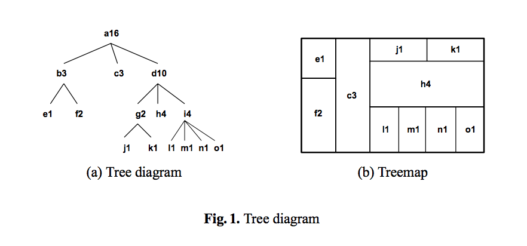
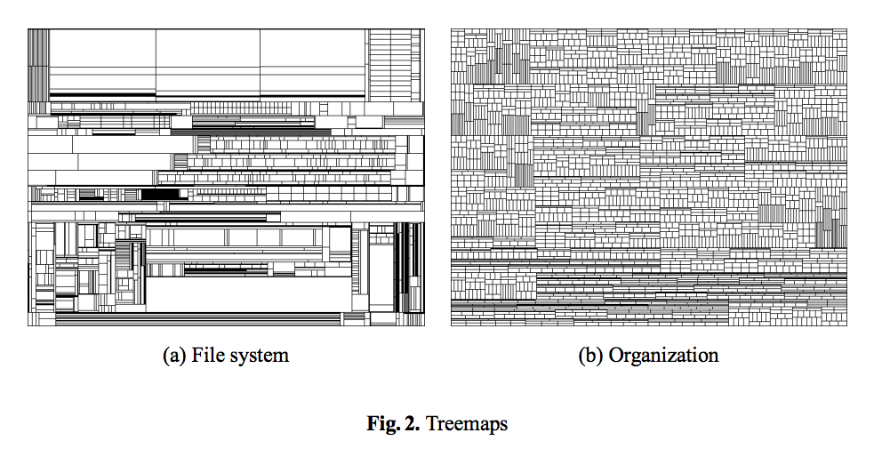
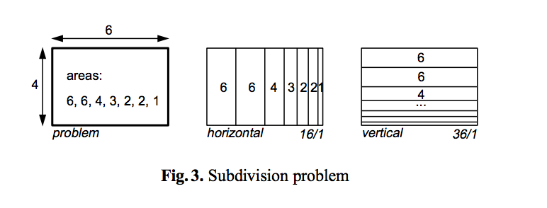
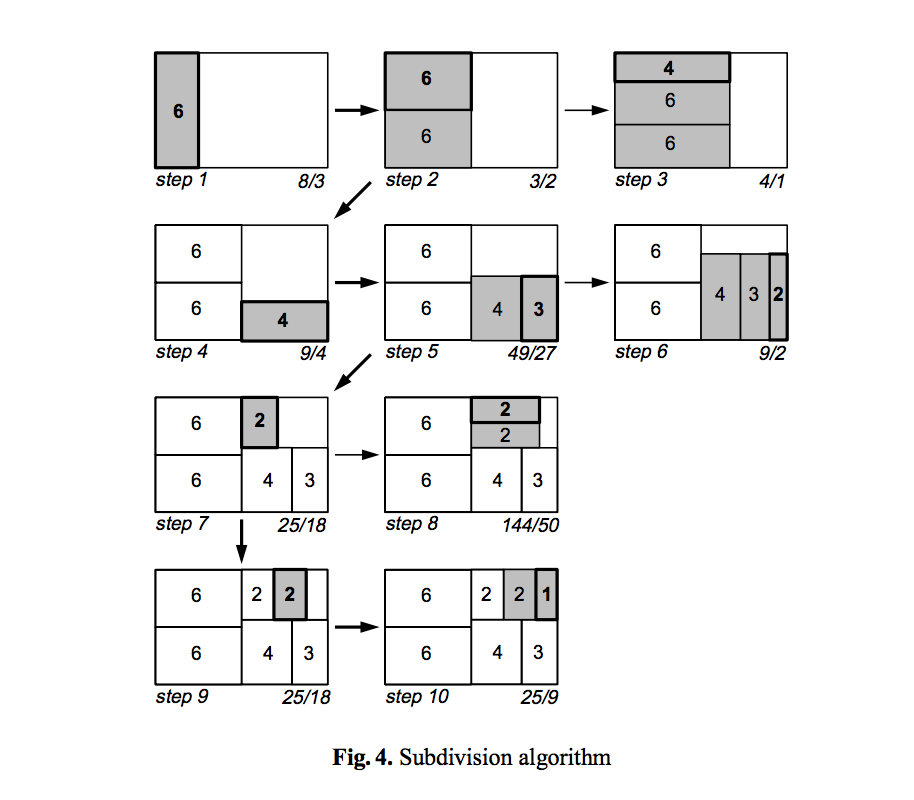
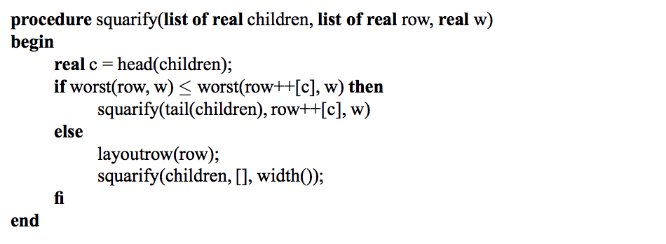
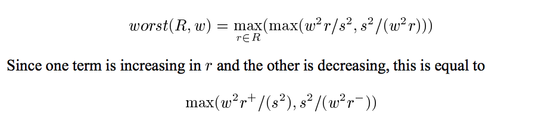
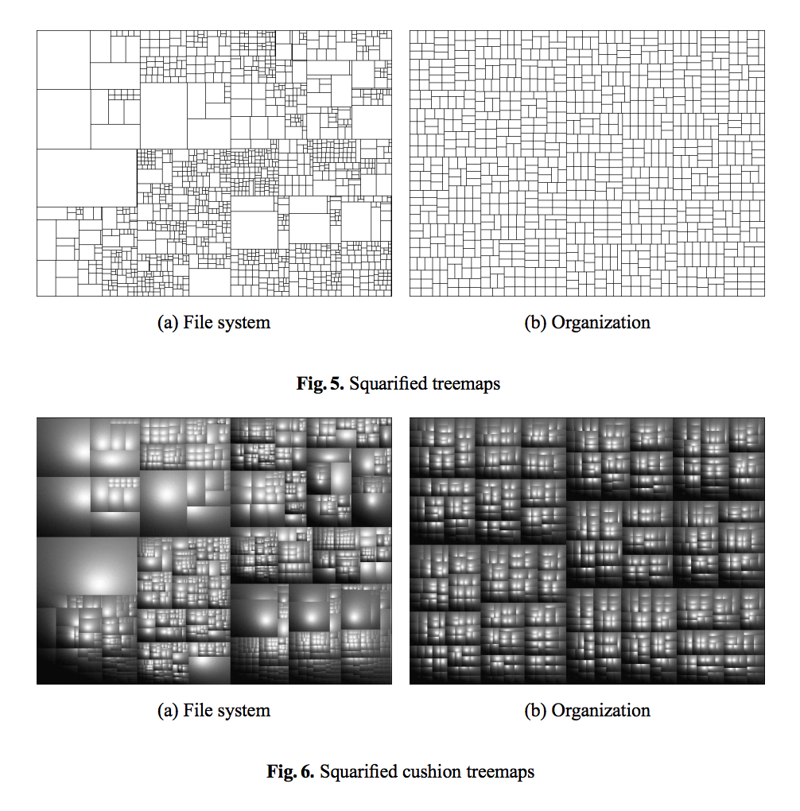
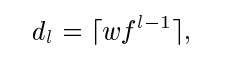
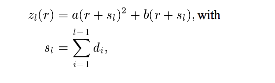
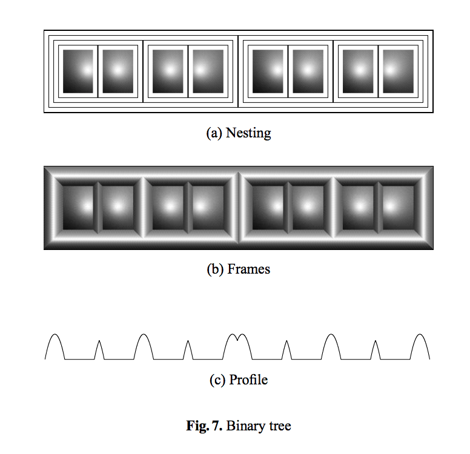

简介: echarts最近给出了一个新的图表：treemap。这篇paper是我开发之前调研学习所用，然后翻译出来了。本文描述了矩形树正方形化算法的核心。第一次翻译，如有纰漏，敬请谅解。

正文

=======
原文：http://www.win.tue.nl/~vanwijk/stm.pdf

## 摘要
本文提出一种矩阵树图的扩展方法，用于可视化层次信息，比如目录结构、组织结构、家谱、计算机程序等等。标准的树状结构图的运行结果往往得到一个个细长的矩形，这些矩形难以比较与选择。本文提出一种新方法来保证布局中的矩形近似正方形，以此增强结构的可视化效果，并且各组相关节点也以阴影框区分。

## 引言
信息的层级结构无处不在：目录结构，组织结构，家谱，计算机程序，等等。简单的层级结构能够有效地查找信息，但对于复杂层级结构中的内容，我们就很难把握了。因此，针对此类复杂的层级结构，我们提出了一种全新的可视化方法：正方形化矩形式树状结构图布局（Squarified Treemaps）。该方法基于由Shneiderman和Johnson [ 9，6 ]发明的矩形式树状结构图（Treemaps）。该图布局高效、紧凑，尤其能有效地展示最终元素在整体结构中所占的大小。
在过去的一篇论文中[10]我们介绍了Cushion Treemaps，此方法用阴影强调层级结构。在本文中，我们将关注标准树状结构图的另一个问题：生成的矩形过于细长。我们将提出一个细分矩形区域的新方法，使得产生的子级矩形具有较低的纵横比。这些矩形将更有效地利用空间，更容易交互，更便于估计大小。对于某些难以直观把握的结构，我们还将介绍一种改进方法以使其更直观。我们还将介绍另一种图：栅格式树状结构图，在这种图中，矩形将被栅格替代。这两者的结合将会使层级结构更加直观。

* 本文的第二节我们将讨论几种层级结构可视化的方法。
* 第三节将重点描述前面提到的全新的切分方法。
* 第四节将讨论阴影框（shaded frames）
* 第五部分是总结讨论。

## 背景
&emsp;&emsp;当今已有许多遍历与展示层级信息结构树的方法。最知名的例子就是文件浏览器。我们通常使用缩进方式展现层次结构的层级，比如文件目录列表。在这种方式下，同时展示的文件与目录的数量是有限的，当然了，如果我们确切的知道我们要找到东西，那这些就不是问题。然而，若是我们仅仅想概览一下，或者想解答一些全局性的问题，诸如：“特么我的磁盘怎么红了？”我们不得不频繁地滚动，打开、关闭子目录，这样我们就很难统筹且直观地对全局结构留下印象。

&emsp;&emsp;使此类结构更有效的可视化的方法已经有很多了。比较重要的一类就是树图（Fig.1（a））。用节点来表示元素，用父节点到子节点的线段来表示关系。无论是二维表现形式亦或是三维的，人们都曾经设计过复杂的方法使这类图更有效率也更美观。对于较简单的树结构来说，这些图都是很有效的，但是当要展示几百个节点的树时，就不行了。这一限制的主要原因很简单，就是点线树图太浪费空间了，你没发现吗，其实大部分区域都仅仅是无意义的背景而已。因此为了解决这个问题，人们发明了矩形式树状结构图（Treemaps）[9, 6] 。整个展示区域都在表示树的内容。Fig.1（b）所示，每个节点（如图所示）都有名字（字母表示）和相应的大小（数字表示）。如果用该图表示文件结构图，那么叶子节点的大小就能表示各个文件的体积，父节点就能表示文件夹的体积也就是它包含的文件体积之和。我们通过递归的切分整个一个大矩形来构建矩形式树状结构图。每个子矩形的面积均与对应节点的大小一致。切分的方法在每一级其实都是一个循环：先横向后纵向然后再横向……。结果就是，原来的大矩形被按照所对应的节点的大小划分成较小的矩形。因此，整个树的结构就能映射进矩形式树状结构图（treemap）了。另外，我们还可以用不同的颜色和注释来标注节点额外的信息。


&emsp;&emsp;矩形式树状结构图（treemap）的优势是能最大限度展示节点的尺寸特征。Fig.2(a)就大体展示了一个文件系统：总共展示了1400个文件，但我们能一眼看出哪个文件是最大的。


&emsp;&emsp;然而矩形式树状结构图亦有局限。一个问题就是不容易看出树的结构。比如平衡树（balanced tree）就有着最差劲的效果，因为它的每个父节点都有相同数量的子节点而且每个子节点的大小是相同的。Fig.2(b) 是一个我们设计的例子，六个级别3060个矩形被画出来。在上一篇论文中我们阐述了如何利用阴影来改善这幅图的视觉效果。


&emsp;&emsp;那么在本文中，我们将研究矩形式树状结构图的另一个问题。由于我们在绘图的时候使用了直接的切分方法，导致了很多细长的矩形出现。所有的子节点都是用同样的方法切分出来的，因此当一个节点的兄弟们都很大而它本身很小时，它展示的效果就会很不理想。（想想Unix系统根目录中的那个可怜的孤独的孱弱的.cshrc文件吧。）所以，所有的节点都更接近正方形的话就会带来若干好处：


* 更有效地利用空间。周长面积比更低，众所周知最低的时候是正方形。
- 人们更善于观察和操作正方形格子，相比之下细长的矩形就是个杯具。
- 人们也更容易比较估算接近正方形的格子的大小
- 提高展现的精确性。比方说一个300像素宽的矩形，粗略的几步就能绘制出来。

&emsp;&emsp;这些优点促使我们研究能让矩形尽量接近正方形的切分替代技术。在写这篇论文的末期，我们发现不单单只是我们在对这个点进行研究，这一思路早就被应用于股市了，为股市提供了非常清晰与高效的数据可视化方案。[11]




## 正方形化的方法
&emsp;&emsp;我们如何把一个矩形递归地切分成纵横比尽可能等于1的小矩形呢？切分的方法很多很多，因此该问题就变成了一个NP-hard问题。然而，我们并不需要得到最优解，一个在短时间内能计算出来的比较好的解就行了。我们已经试验过了很多算法。在这一部分我们只是提供一个我们认为能给出最佳解决方案的方法。这一算法的核心思想基于两点：

* 第一，我们并不想让树的所有级同时被切分，这会导致运算时间的激增。我们想要得到的是为一组兄弟节点生成接近正方形的矩形，并生成一个容纳他们的父矩形，重要的是，我们可以递归地运行这一步骤。下一级的起点将会是一个有着较优切分与较优展现的接近正方形的矩形。
* 第二，对于标准的矩形式树状结构图中的一组兄弟节点，我们用一种类似于层级切分的方法替换的直接切分法（规定宽或高的方法，同方向切分的方法等）。

&emsp;&emsp;首先，我们想用一个例子来表示我们的方法，然后，我们就讲描述完整的算法。

### 例子
&emsp;&emsp;现在有一个宽度为6高度为4的矩形，然后该矩形将要被切分为七块面积分别为：6, 6, 4, 3, 2, 2, 1。（Fig.3）通常的切分算法就是一个简单的逼近：横向或者纵向切分大矩形。结果就是生成了很多细长的小矩形，纵横比分别达到了16和36。



&emsp;&emsp;我们算法的第一步也是分割原始大矩形。我们选择了横向切分方式，因为原始矩形的宽大于高。然后我们从左半边开始填充。首先我们填充一个矩形（Fig.4），第一个矩形的纵横比是8/3。然后我们在第一个上面填充第二个矩形，发现纵横比改善成为3/2。接下来若是我们再在上面增加一个矩形，发现纵横比变差了成为4/1。因此我们认为在第二步时已经得到了左半边的最优解，然后我们开始填充右半边。



&emsp;&emsp;在右半边第一步切分我们选择纵向，因为该矩形的高大于宽。第4步我们增加面积为4的矩形，第5步我们增加面积为3的矩形，发现纵横比降低了。在第六步我们继续增加面积为2的矩形时，纵横比变差了。所以我们使用第5步的结果。然后继续前进，填充右上角区域。


&emsp;&emsp;重复以上步骤直到所有的矩形都均被填充。在此，我再强调一下，我们不能保证一定得到最优解，可以举出反例证明这一点。小矩形的填充顺序是十分重要的，我们发现从大到小填充常常得到较优的解。因此原始矩形将从较大的子矩形开始填充。
### 算法
&emsp;&emsp;了解了例子之后，我们提出我们的算法——squarify，也就是在一个矩形中递归的进行子矩形布局的过程。这一过程横向或纵向布局矩形。一个矩形被填充之前，将要做一个二选一的决定：

* 1.该矩形被添加进当前列；

* 2.该矩形被填充进剩余区域并产生一个新列，而这一决定仅仅依赖于该矩形被填充入列后该列中矩形的纵横比是否减小。
	

&emsp;&emsp;我们定义一个全局数据结构Rectangle 以储存计算过程中的布局信息。Rectangle包含width() 函数，该函数返回剩余矩形区域最短边的长度；Rectangle也有一个layoutrow() 函数，它的作用是往区域中添加新的列。为了使描述简单，我们定义了一些伪代码语法，++是list的关联操作，[x]表示list中的一项x，[]表示一个空list。（译者：其实就是个数组） 

&emsp;&emsp;squarify() 函数的输入是一个由表示各个子节点面积的数字所组成的list。声明为row的list包含正在被填充的所有矩形。函数worst() 返回一个矩形list中的最差也就是最大纵横比，参数是我们将要填充区域的边长，我们以后再具体讨论这个函数。




&emsp;&emsp;若矩形面积的list是R，它的长度（矩形总数）是s，那么worst函数就是：




&emsp;&emsp;r+和 r- 分别为R的最大与最小值，因此我们得到了最大与最小纵横比。

&emsp;&emsp;把这个算法运用到Fig.2的数据中就得到了Fig.5 。显而易见算法是成功的，矩形没那么窄了，那些杂乱的矩形也消失了。然而，和标准矩阵树图相比，展示层级结构会不太明显。
绘制方法的选择目的是为用户观察图表提供更好的视觉线索与细节，而不规范的方法就会让这些视觉线索消失。当数据量非常大时，（Fig.5(a)）有个细节不知大家注意到了吗，从左下角到右上角，矩形的面积在减小，这样就或多或少提示了哪些子节点拥有同一个父节点。然而，如果节点的大小相当(Fig.5(b)), 
这些细节就不会被展现。

&emsp;&emsp;改善结构可视性的一种方法就是使用缓冲（cushion）(Fig.6). 
但是呢，整体的感官并不明显，比如Fig.6(b) 就很难指出数据中7个一级节点。因此，我们探究一种附加方法来强化这些图表的可视性。



### 边框
&emsp;&emsp;栅格化是Shneiderman与Johnson [9, 6]为了强化矩形式树状结构图的可视性而提出的。代表非叶子节点的矩形都加上一个边框，这样就能明示它们的子节点拥有相同的父亲。figure 7(a) 展示了一个平衡树的例子。但这种方式有一些弊端。增加了很多额外的显示面积，而且看起来跟迷宫似的，用户都糊涂了。


&emsp;&emsp;然而，后一种缺点却能用与增强节点可视性类似的方法够修正。我们用基于简单几何模型的灰色阴影填充边框(figure8). 层级l的边框的像素宽度为dl，那么当l = 1, … ,n时，公式就是：
	


	
&emsp;&emsp;其中w为根节点边框宽度，f为能够降低较低层级节点边框宽度的因子（factor）。
边框的轮廓是二次方程：




&emsp;&emsp;zl(r) 为层级l轮廓的高度，r是到达这一级边框外的距离。a和b是两个控制抛物线形状的系数。

&emsp;&emsp;Fig.7(b) 展示了二叉树的结果。这个（夸张的）例子中，我们令w = 8, f = 1, a = -1, b = 16，这样的话，抛物线的顶端就会反转至内部。Fig.7(c) 表示了本例中边框的轮廓。figure 9就应用了相似的轮廓，它的好处是：


* 栅格边框看起来更有质感
-	由于边框高度的不同，每个节点的深度更容易观察
-	相邻的一级节点边界，比如节点4与节点5之间的边界，由于抛物线的反转，会显示出一个缩进。
-	相邻的二级节点边界，比如节点2与节点3之间的边界，能共用一个平滑的顶部
-	较低级别的边界，顶部就不平滑了



## 讨论
&emsp;&emsp;本文提出了对矩形式树状结构图的两个扩展。第一，我们展示了如何让矩形更接近正方向，这就使得矩形更容易比较、交互，也能更精确地表现节点大小。第二，我们展示了如何使用边框来改善可视性。然而，两者均有局限性。在正方形化算法中，兄弟节点的相对顺序信息遗失了，最终产生的图表也变得比传统画法更凌乱。但是，当需要展示的重点是树的结构信息而非数据顺序时，本文提出的算法将会非常有用。
